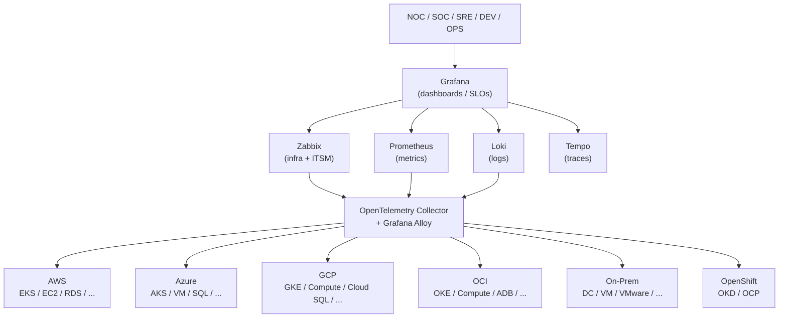

# High-Level Design

## Goal

One observability platform, multiple clouds, multiple clusters, central governance:
Zabbix as the infrastructure/business-monitoring and ITSM-alerting core, unified with
Prometheus/Grafana/Loki/Tempo for the three observability pillars (metrics, logs, traces),
deployed identically everywhere via a single Helm chart and reconciled everywhere via
GitOps (Argo CD).

## Component responsibilities

| Component | Responsibility | Why it's here rather than something else |
|---|---|---|
| Zabbix Server/Proxy/Agent2 | Infra + business-service monitoring, native alerting/ITSM, distributed collection via proxies | Explicit requirement of this platform; also the natural home for triggers/SLA reporting that predates the Prometheus ecosystem |
| Prometheus (kube-prometheus-stack) | Kubernetes/cloud-native metrics, alerting rules, Alertmanager | De facto standard for Kubernetes metrics; Operator model gives us ServiceMonitor/PrometheusRule as code |
| Grafana | Single pane of glass across all datasources (Zabbix, Prometheus, Loki, Tempo) | Only visualization layer with a maintained Zabbix datasource plugin alongside native Prometheus/Loki/Tempo support |
| Loki | Log aggregation | Label-indexed like Prometheus, keeps the metrics/logs correlation model consistent, cheaper to run than a full-text index at this scale |
| Grafana Alloy | Node-level unified collection agent (metrics + logs, Kubernetes-aware discovery) | Single agent instead of separately-run node-exporter/promtail/otel-agent DaemonSets |
| OpenTelemetry Collector | Vendor-neutral application telemetry ingestion (OTLP/Jaeger/Zipkin) → fan-out to Tempo/Prometheus/Loki | Avoids coupling application instrumentation to any single backend |
| Tempo | Trace storage | Object-storage-backed, same operational model as Loki |
| Argo CD | GitOps reconciliation, multi-cluster fan-out | Declared desired state in Git is the only source of truth - no cluster is ever hand-configured |

## Architecture diagram

## Deployment topology

One Helm release (`charts/zabbix-enterprise`) per cluster/environment cell, reconciled by
one Argo CD `Application` generated from the `zabbix-enterprise` `ApplicationSet` (see
`gitops/README.md`). Zabbix Server runs in native HA-cluster mode (>=6.4) across multiple
replicas sharing one database; each cloud/region/datacenter gets its own Zabbix Proxy
instance(s) for distributed, store-and-forward-resilient collection (see
`values.zabbix.proxy.instances` and section "Zabbix Server Distribuído" of the original
spec).

## Data flow

1. **Infra/business metrics** → Zabbix Agent2 (DaemonSet, host-level) / Zabbix Proxy
   (cloud-specific exporters bridged via HTTP Agent + Prometheus-pattern preprocessing,
   see `docs/cloud/`) → Zabbix Server → Grafana (Zabbix datasource) + Alertmanager-style
   alerting via Zabbix's own trigger/action engine.
2. **Kubernetes/cloud-native metrics** → kube-state-metrics/node-exporter/cloud exporters
   → Prometheus (remote-write via Alloy where applicable) → Grafana + Alertmanager
   (`PrometheusRule`/`AlertmanagerConfig`, see `templates/prometheusrule/`).
3. **Logs** → Grafana Alloy (Kubernetes pod log discovery) → Loki → Grafana, trace-correlated
   via `derivedFields` (`trace_id` → Tempo).
4. **Traces** → Application OpenTelemetry SDKs → OpenTelemetry Collector (OTLP/Jaeger/Zipkin
   receivers) → Tempo → Grafana, service-map correlated back to Prometheus.

## Related documents

- [LLD](LLD.md) - namespace layout, resource sizing, HA topology detail
- [C4 model](c4-model.md)
- [SRE / SLOs](../sre/slo-definitions.md)
- [Security](../security/)
