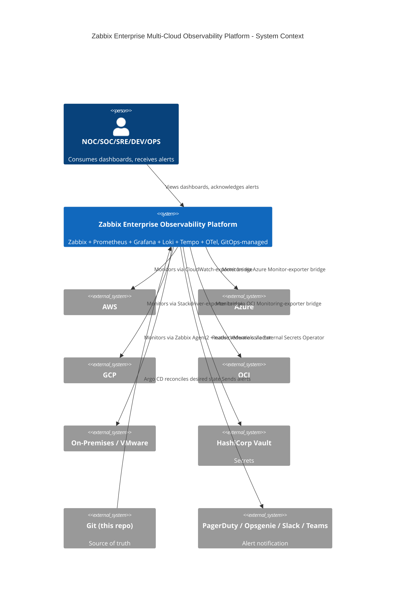
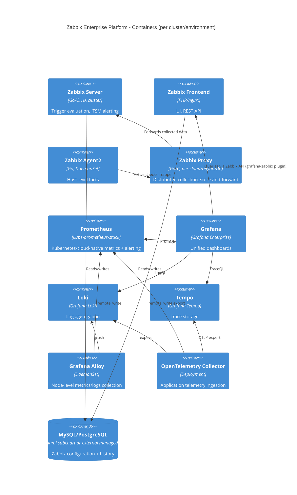
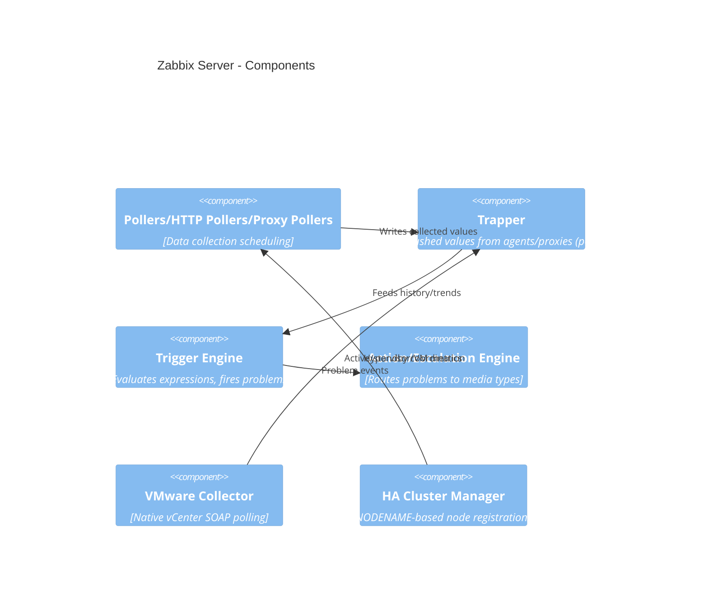

# C4 Model

## Level 1 - System Context

```mermaid
C4Context
    title Zabbix Enterprise Multi-Cloud Observability Platform - System Context
    Person(noc, "NOC/SOC/SRE/DEV/OPS", "Consumes dashboards, receives alerts")
    System(platform, "Zabbix Enterprise Observability Platform", "Zabbix + Prometheus + Grafana + Loki + Tempo + OTel, GitOps-managed")
    System_Ext(aws, "AWS")
    System_Ext(azure, "Azure")
    System_Ext(gcp, "GCP")
    System_Ext(oci, "OCI")
    System_Ext(onprem, "On-Premises / VMware")
    System_Ext(vault, "HashiCorp Vault", "Secrets")
    System_Ext(git, "Git (this repo)", "Source of truth")
    System_Ext(pagerduty, "PagerDuty / Opsgenie / Slack / Teams", "Alert notification")

    Rel(noc, platform, "Views dashboards, acknowledges alerts")
    Rel(platform, aws, "Monitors via CloudWatch-exporter bridge")
    Rel(platform, azure, "Monitors via Azure Monitor-exporter bridge")
    Rel(platform, gcp, "Monitors via Stackdriver-exporter bridge")
    Rel(platform, oci, "Monitors via OCI Monitoring-exporter bridge")
    Rel(platform, onprem, "Monitors via Zabbix Agent2 + native VMware collector")
    Rel(platform, vault, "Reads credentials via External Secrets Operator")
    Rel(git, platform, "Argo CD reconciles desired state")
    Rel(platform, pagerduty, "Sends alerts")
```

## Level 2 - Containers

```mermaid
C4Container
    title Zabbix Enterprise Platform - Containers (per cluster/environment)
    Container(zbxsrv, "Zabbix Server", "Go/C, HA cluster", "Trigger evaluation, ITSM alerting")
    Container(zbxfe, "Zabbix Frontend", "PHP/nginx", "UI, REST API")
    Container(zbxagent, "Zabbix Agent2", "Go, DaemonSet", "Host-level facts")
    Container(zbxproxy, "Zabbix Proxy", "Go/C, per cloud/region/DC", "Distributed collection, store-and-forward")
    Container(prom, "Prometheus", "kube-prometheus-stack", "Kubernetes/cloud-native metrics + alerting")
    Container(grafana, "Grafana", "Grafana Enterprise", "Unified dashboards")
    Container(loki, "Loki", "Grafana Loki", "Log aggregation")
    Container(tempo, "Tempo", "Grafana Tempo", "Trace storage")
    Container(alloy, "Grafana Alloy", "DaemonSet", "Node-level metrics/logs collection")
    Container(otel, "OpenTelemetry Collector", "Deployment", "Application telemetry ingestion")
    ContainerDb(db, "MySQL/PostgreSQL", "Bitnami subchart or external managed DB", "Zabbix configuration + history")

    Rel(zbxagent, zbxproxy, "Active checks, trapper")
    Rel(zbxproxy, zbxsrv, "Forwards collected data")
    Rel(zbxsrv, db, "Reads/writes")
    Rel(zbxfe, db, "Reads/writes")
    Rel(grafana, zbxfe, "Queries via Zabbix API (grafana-zabbix plugin)")
    Rel(grafana, prom, "PromQL")
    Rel(grafana, loki, "LogQL")
    Rel(grafana, tempo, "TraceQL")
    Rel(alloy, prom, "remote_write")
    Rel(alloy, loki, "push")
    Rel(otel, tempo, "OTLP export")
    Rel(otel, prom, "remote_write export")
    Rel(otel, loki, "export")
```

## Level 3 - Components (Zabbix Server container)

```mermaid
C4Component
    title Zabbix Server - Components
    Component(pollers, "Pollers/HTTP Pollers/Proxy Pollers", "Data collection scheduling")
    Component(trapper, "Trapper", "Accepts pushed values from agents/proxies (port 10051)")
    Component(triggers, "Trigger Engine", "Evaluates expressions, fires problems")
    Component(actions, "Action/Escalation Engine", "Routes problems to media types")
    Component(vmwarecol, "VMware Collector", "Native vCenter SOAP polling")
    Component(hacluster, "HA Cluster Manager", "ZBX_HANODENAME-based node registration/failover")

    Rel(pollers, trapper, "Writes collected values")
    Rel(trapper, triggers, "Feeds history/trends")
    Rel(triggers, actions, "Problem events")
    Rel(vmwarecol, trapper, "Hypervisor/VM metrics")
    Rel(hacluster, pollers, "Active/standby coordination")
```
