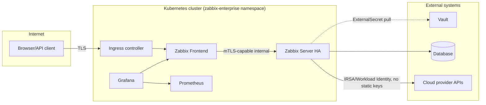

# Threat Model

Lightweight STRIDE pass over the platform's trust boundaries. Not exhaustive - treat as
the starting checklist for a full threat-modeling session, not a substitute for one.

## Trust boundaries

## Threats and mitigations

| Threat (STRIDE) | Scenario | Mitigation | Where |
|---|---|---|---|
| Spoofing | Unauthenticated access to the Zabbix frontend/API | SSO (OIDC/SAML/Entra ID), Ingress TLS-only | `values.zabbix.frontend.sso`, `templates/zabbix-frontend/ingress.yaml` |
| Spoofing | A rogue pod impersonating a Zabbix Proxy to inject false data | Proxy identity via `ZBX_HOSTNAME` tied to a pre-registered Zabbix proxy record; NetworkPolicy restricts who can reach the trapper port | `templates/zabbix-proxy/`, `templates/networkpolicy/allow-internal.yaml` |
| Tampering | Modifying a running deployment out-of-band, drifting from Git | Argo CD `selfHeal` reverts untracked changes automatically | `syncPolicy.automated.selfHeal` in `applicationset.yaml` |
| Tampering | Supply-chain: a malicious image published under a similar name | Kyverno `verifyImages` (Cosign signature check, currently Audit mode) | `gitops/infrastructure/policies/kyverno-baseline.yaml` |
| Repudiation | No audit trail for who changed platform configuration | Every change is a Git commit + PR review; Argo CD sync history is queryable (`argocd app history`) | GitOps model overall |
| Information Disclosure | Credentials committed to Git in plaintext | No Secret objects committed; ExternalSecret/SealedSecret only; `.gitignore` blocks `*.secret.yaml` | `templates/database/externalsecret.yaml`, `.gitignore` |
| Information Disclosure | Cross-tenant data leakage in a shared Grafana | Grafana Organizations/Folders/Teams scoping per tenant (see IAM model) | `docs/security/iam-model.md` |
| Denial of Service | Alert storm/cardinality explosion overwhelming Prometheus | Resource limits enforced via Kyverno; Prometheus resource requests/limits sized per environment | `gitops/infrastructure/policies/kyverno-baseline.yaml`, `values-prd.yaml` |
| Denial of Service | Proxy link outage causing unbounded data loss | Store-and-forward buffering (90 days in prd) | `values.zabbix.proxy.buffering` |
| Elevation of Privilege | Compromised Zabbix Agent2 pod pivoting to the node | `hostPID: true` is required for host-level checks but capabilities are dropped to only `SYS_PTRACE`, `readOnlyRootFilesystem: true`, no privileged mode | `templates/zabbix-agent/daemonset.yaml` |
| Elevation of Privilege | Over-broad RBAC on the shared ServiceAccount | Namespaced `Role` (get/list/watch only) + a separate read-only `ClusterRole` (no cluster-scoped write verbs at all) | `templates/rbac/` |

## Assumptions this model depends on

- External Secrets Operator, Kyverno, and Velero are installed and patched as cluster
  add-ons independently of this chart (see `gitops/infrastructure/`) - this repo assumes
  their controllers are trustworthy, it does not threat-model them.
- Vault itself (its unseal/root-token handling, HA, audit logging) is out of scope here -
  see your organization's Vault-specific hardening guide.
- Cloud IAM roles (IRSA/Workload Identity/Instance Principal) granted to the exporters
  are least-privilege *read-only* monitoring roles - verify this at role-creation time,
  it isn't enforced by anything in this repository.
